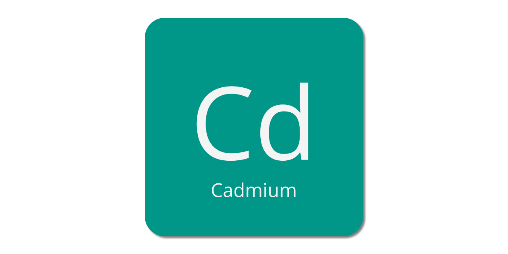

[](https://travis-ci.org/watzon/cadmium) 

Cadmium is a Natrual Language Processing (NLP) library for Crystal. Included are classes and modules for tokenizing, inflecting, stemming, and creating n-grams with much more to come.

It's still in early development, but tests are being written as I go so hopefully it will be somewhat stable.

This library is heavily based on the [natural](https://github.com/NaturalNode/natural) library for node.js, and as such you can expect the API's to be very similar. As a point of fact, most of the specs for Cadmium were copied directly from natural and lightly modified.

Any utilities that can be internationalized will be eventually. For now English is the primary concern.

For full API documentation check out [the docs](https://watzon.github.io/cadmium/).

## Table of Contents

- [Installation](#installation)
- [Tokenizers](#tokenizers)
- [String Distance](#string-distance)
- [Stemmers](#stemmers)
- [Phonetics](#phonetics)
- [Inflectors](#inflectors)
- [N-Grams](#n-grams)
- [tf-idf](#tf-idf)
- [Transliterator](#transliterator)
- [Sentiment Analysis](#sentiment-analysis)
- [Tries](#tries)
- [Readability](#readability)
- [WordNet](#wordnet)
- [Roadmap](#roadmap)
- [Contributing](#contributing)
- [Contributors](#contributors)

## Installation

Add this to your application's `shard.yml`:

```yaml
dependencies:
  cadmium:
    github: watzon/cadmium
    branch: master
```

## Usage

Require the cadmium library in your project

```crystal
require "cadmium"
```

### Tokenizers

Cadmium includes several different tokenizers, each of which is useful for different applications.

#### Aggressive Tokenizer

The aggressive tokenizer currently has localization available for English (:en / nil), Spanish (:es), Persian (:fa), French (:fr), Indonesian (:id), Dutch (:nl), Norwegian (:no), Polish (:pl), Portuguese (:pt), Russian (:ru), and Swedish (:sv). If no language is included it will default to English.

Use it like so:

```crystal
tokenizer = Cadmium::Tokenizer::AggressiveTokenizer.new(lang: :es)
tokenizer.tokenize("hola yo me llamo eduardo y esudié ingeniería")
# => ["hola", "yo", "me", "llamo", "eduardo", "y", "esudié", "ingeniería"]
``` 

#### Case Tokenizer

The case tokenizer doesn't rely on Regex and as such should be pretty fast. It should also work on an international basis fairly easily.

```crystal
tokenizer = Cadmium::Tokenizer::CaseTokenizer.new
tokenizer.tokenize("these are strings")
# => ["these", "are", "strings"]

tokenizer = Cadmium::Tokenizer::CaseTokenizer.new(preserve_apostrophes: true)
tokenizer.tokenize("Affectueusement surnommé « Gabo » dans toute l'Amérique latine")
# => ["Affectueusement", "surnommé", "Gabo", "dans", "toute", "l", "Amérique", "latine"]
```

#### Regex Tokenizer

The whitespace tokenizer, word punctuation tokenizer, and word tokenizer all extend the regex tokenizer. It uses Regex to match on the correct values.

```crystal
tokenizer = Cadmium::Tokenizer::WordPunctuationTokenizer.new
tokenizer.tokenize("my dog hasn't any fleas.")
# => ["my", "dog", "hasn", "'", "t", "any", "fleas", "."]
```

#### Treebank Word Tokenizer

The treebank tokenizer uses regular expressions to tokenize text as in Penn Treebank. This implementation is a port of the tokenizer sed script written by Robert McIntyre. To read about treebanks you can visit [wikipedia](https://en.wikipedia.org/wiki/Treebank).

```crystal
tokenizer = Cadmium::Tokenizer::TreebankWordTokenizer.new
tokenizer.tokenize("If we 'all' can't go. I'll stay home.")
# => ["If", "we", "'all", "'", "ca", "n't", "go.", "I", "'ll", "stay", "home", "."]
```

### String Distance

Corundum provides an implimentation of two different string distance algorithms, the [Jaro-Winkler Distance Algorithm](http://en.wikipedia.org/wiki/Jaro%E2%80%93Winkler_distance) and the [Levenshtein Distance Algorithm](https://en.wikipedia.org/wiki/Levenshtein_distance).

#### Jaro-Winkler

The Jaro-Winkler algorithm returns a number between 0 and 1 which tells how closely two strings match (1 being perfect and 0 being not at all).

```crystal
Cadmium.jaro_winkler_distance("dixon","dicksonx")
# => 0.8133333333333332

Cadmium.jaro_winkler_distance("same","same")
# => 1

Cadmium.jaro_winkler_distance("not","same")
# => 0.0
```

#### Levenshtein

The Levenshtein distance algorithm returns the number of edits (insertions, modifications, or deletions) required to transform one string into another.

```crystal
Cadmium.levenshtein_distance("doctor", "doktor")
# => 1

Cadmium.levenshtein_distance("doctor", "doctor")
# => 0

Cadmium.levenshtein_distance("flad", "flaten")
# => 3
```

### Stemmers

Currently Cadmium only comes with a [Porter](http://tartarus.org/martin/PorterStemmer/index.html) Stemmer, but [Lancaster](http://www.comp.lancs.ac.uk/computing/research/stemming/) will be added soon. Stemmer methods `stem` and `tokenize_and_stem` have also been added to the String class to simplify use.

```crystal
"words".stem
# => word

"i am waking up to the sounds of chainsaws".tokenize_and_stem
# => ["wake", "sound", "chainsaw"]
```

### Phonetics

Phonetic matching (sounds-like) matching can be done with the SoundEx or Metaphone algorithms

```crystal
soundex = Cadmium::Phonetics::SoundEx
metaphone = Cadmium::Phonetics::Metaphone

soundex.process("phonetics")
# => "P532"

soundex.tokenize_and_phoneticize("Ruby aint got nothing on Crystal")
# => ["R100", "A530", "G300", "C234"]

# Keep word stops
soundex.tokenize_and_phoneticize("Ruby aint got nothing on Crystal", true)
# => ["R100", "A530", "G300", "N352", "O000", "C234"]

soundex.compare("phonetix", "phonetics")
# => true

metaphone.process("phonetics")
# => "FNTKS"

metaphone.tokenize_and_phoneticize("Ruby aint got nothing on Crystal")
# => ["RB", "ANT", "KT", "KRSTL"]

# Keep word stops
metaphone.tokenize_and_phoneticize("Ruby aint got nothing on Crystal", true)
# => ["RB", "ANT", "KT", "N0NK", "ON", "KRSTL"]

metaphone.compare("phonetix", "phonetics")
# => true
```

Both classes can also be used with attached String methods. The default class for String methods is `Metaphone`. The attached methods are `phonetics`, `sounds_like`, and `tokenize_and_phoneticize`.

```crystal
"Crystal".phonetics
# => "KRSTL"

"Crystal".sounds_like("Krystal")
# => true

"Crystal".phonetics(nil, Cadmium::Phonetics::SoundEx)
# => "C234"

# Using a max length
"Constitution".phonetics(6, Cadmium::Phonetics::SoundEx)
# => "C52333"
```

### Inflectors

#### Nouns

Nouns can be inflected using the `NounInflector` which has also been attached to the `String` class.

```crystal
inflector = Cadmium::Inflectors::NounInflector.new

inflector.pluralize("radius")
# => radii

inflector.singularize("radii")
# => radius

"person".pluralize
# => people

"people".singularize
# => person
```

#### Present Tense Verbs

Present tense verbs can be inflected with the `PresentTenseVerb` inflector. This has also been attached to the string class.

```crystal
inflector = Cadmium::Inflectors::PresentTenseVerb.new

inflector.singularize("become")
# => became

inflector.pluralize("became")
# => become

"walk".singularize(false) # noun: false
# => walks

"walks".pluralize(false)  # noun: false
# => walk
```

#### Numbers

Numbers can be inflected with the `CountInflector` which also adds a method `to_nth` to the `Int` class.

```crystal
Cadmium::Inflectors::CountInflector.nth(1)
# => 1st

Cadmium::Inflectors::CountInflector.nth(111)
# => 111th

153.to_nth
# => 153rd
```

### N-Grams

N-Grams can be obtained for Arrays of Strings, or with single Strings (which will first be tokenized).

#### bigrams

```crystal
Cadmium::NGrams.bigrams("these are some words")
# => [["these", "are"], ["are", "some"], ["some", "words"]]
```

#### trigrams

```crystal
Cadmium::NGrams.trigrams("these are some words")
# => [["these", "are", "some"], ["are", "some", "words"]]
```

#### arbitrary n-grams

```crystal
Cadmium::NGrams.ngrams("some other words here for you", 4)
# => [["some", "other", "words", "here"], ["other", "words", "here", "for"], ["words", "here", "for", "you"]]
```

#### padding

n-grams can also be returned with left or right padding by passing a start and/or end symbol to the bigrams, trigrams or ngrams.

```crystal
Cadmium::NGrams.ngrams("these are some words", 4, "[start]", "[end]")
# => [
      ["[start]", "[start]", "[start]", "these"],
      ["[start]", "[start]", "these", "are"],
      ["[start]", "these", "are", "some"],
      ["these", "are", "some", "words"],
      ["are", "some", "words", "[end]"],
      ["some", "words", "[end]", "[end]"],
      ["words", "[end]", "[end]", "[end]"]
    ]
```

### tf-idf

[Term Frequency–Inverse Document Frequency (tf-idf)](http://en.wikipedia.org/wiki/Tf%E2%80%93idf) is implemented to determine how important a word (or words) is to a document relative to a corpus. The following example will add four documents to a corpus and determine the weight of the word "crystal" and then the weight of the word "ruby" in each document.

```crystal
tfidf = Cadmium::TfIdf.new
tfidf.add_document("this document is about crystal.")
tfidf.add_document("this document is about ruby.")
tfidf.add_document("this document is about ruby and crystal.")
tfidf.add_document("this document is about crystal. it has crystal examples")

puts "crystal --------------------------------"
tfidf.tfidfs("crystal") do |i, measure, key|
  puts "document ##{i} is #{measure}"
end

puts "ruby --------------------------------"
tfidf.tfidfs("ruby") do |i, measure, key|
  puts "document ##{i} is #{measure}"
end

# =>  crystal --------------------------------
      document #0 is 1
      document #1 is 0
      document #2 is 1
      document #3 is 2
      ruby --------------------------------
      document #0 is 0
      document #1 is 1.2876820724517808
      document #2 is 1.2876820724517808
      document #3 is 0
```

### Transliterator

The Transliterator module provides the ability to transliterate UTF-8 strings into pure ASCII so that they can be safely displayed in URL slugs or file names.

```crystal
Cadmium.transliterate("Привет")
# => "Privet"

Cadmium.transliterate("你好朋友")
# => "Ni Hao Peng You"

# With the string extension

"މިއަދަކީ ހދ ރީތި ދވހކވ".transliterate
# => "mi'adhakee hdh reethi dhvhkv"

"こんにちは、友人".transliterate
# => konnichiwa, You Ren
```

### Sentiment Analysis

The Sentiment module uses the [AFINN-165](http://www2.imm.dtu.dk/pubdb/views/publication_details.php?id=6010) wordlist and [Emoji Sentiment Ranking](http://journals.plos.org/plosone/article?id=10.1371/journal.pone.0144296) to provide sentiment analysis on arbitrary blocks of text.

```crystal
sentiment = Cadmium::Sentiment

"Crystal is seriously the best programming language.".sentiment
# or
sentiment.analyze("Crystal is seriously the best programming language.")
# =>  {
        score: 3,
        comparative: 0,
        tokens: ["Crystal", "is", "seriously", "the", "best", "programming", "language"],
        words: ["best"],
        positive: ["best"],
        negative: []
      }

"I really hate Python".is_negative?
# => true

"I really 💗 Crystal. It's my favorite.".is_positive?
# => true
```

### Tries

A [trie](https://en.wikipedia.org/wiki/Trie) is a data structure for efficiently storing and retrieving strings with identical prefixes, like "**mee**t" and "**mee**k".

```crystal
trie = Cadmium::Trie.new

trie.add("meet")
trie.size
# => 5

trie.add("meek")
trie.size
# => 6

trie.contains?("meet")
# => true

trie.find_prefix("meeting")
# => {"meet", "ing"}
trie.find_prefix("meet")
# => {"meet", ""}
trie.find_prefix("me")
# => {nil, "me"}

trie.keys_with_prefix("me")
# => ["meet", "meek"]

trie.add(["m", "me"])
trie.matches_on_path("meeting")
# => ["m", "me", "meet"]
```

### Readability

Analyze blocks of text and determine, using various algorithms, the readability of the text.

```crystal
text = <<-EOF
    After marriage, the next big event in the couples lives will be their honeymoon. It is a time when the newly weds can get away from relatives and friends to spend some significant time getting to know one another. This time alone together that the couple shares is called the honeymoon. A great gift idea for the married couple would be to give them a surprise tour package. Most women would like to go on a honeymoon.
    The week or two before the ceremonies would be the best time to schedule a tour because then the budget for this event could be considered. In winter there are more opportunities for the couple to get close to one another because of the cold weather. It is easier to snuggle when the weather is not favorable to outdoor activities. This would afford the couple ample time to know more about themselves during the honeymoon.
    Honeymoon plans should be discussed with the wife to ensure that the shock is pleasant and not a negative experience to her. It is also a good idea in this case, to ask her probing questions as to where she would like to go. Perhaps you could get a friend or family member to ask her what would be her favorite travel location. That would ensure that you know just what she is looking for.
    Make sure that the trip is exactly what she wants. Then on the wedding night tell her about the adventure so that the needed accommodations can be made.
EOF

report = Cadmium::Readability.new(text)

puts report.flesch  # => 71.47176470588238
puts report.fog     # => 10.721568627450981
puts report.kincaid # => 7.513725490196077
```

### WordNet

>> WordNet® is a large lexical database of English. Nouns, verbs, adjectives and adverbs are grouped into sets of cognitive synonyms (synsets), each expressing a distinct concept. Synsets are interlinked by means of conceptual-semantic and lexical relations. - [https://wordnet.princeton.edu/](https://wordnet.princeton.edu/)

This WordNet implimentation is based almost completely on [doches](https://github.com/doches) ruby library [rwordnet](https://github.com/doches/rwordnet) with some extras thrown in and, of course, backed by the speed and type safety of Crystal. This is experimental and the API may change, but WordNet brings the power of the English (and hopefully other languages in the future) dictionary to your programs.

Using it is easy with Cadmium's API.

```crystal
# Lookup a single word and get all parts of speech
synsets = Cadmium::WordNet.lookup("horse")
synsets.each do |synset|
  puts "---------------------------------------------"
  puts synset.synset_offset
  puts synset.pos
  puts synset.gloss
  puts synset.word_counts
end

# Lookup a single word with a specific part of speech
synsets = Cadmium::WordNet.lookup("horse", :v) # :v is for verb
synsets.each do |synset|
  puts "---------------------------------------------"
  puts synset.synset_offset
  puts synset.pos
  puts synset.gloss
  puts synset.word_counts
end

# Lookup a definition by offset and part of speech
synset = Cadmium::WordNet.get(4424418, :n) # :n is for noun
puts "---------------------------------------------"
puts synset.synset_offset
puts synset.pos
puts synset.gloss
puts synset.word_counts
```

## Roadmap

This is all I want to have done before a __v1.0__ release.

- [x] Tokenizers
  - [x] AggressiveTokenizer
    - [x] i18n
  - [x] CaseTokenizer
  - [ ] Pragmatic [?](https://github.com/diasks2/pragmatic_tokenizer)
  - [x] RegexTokenizer
  - [x] SentenceTokenizer
  - [x] TreebankWordTokenizer
  - [x] WhitespaceTokenizer
  - [x] WordPunctuationTokenizer
- [x] String Distance
  - [x] Levenshein
    - [ ] Approximate String Matching
  - [x] JaroWinkler
- [ ] Stemmers
  - [x] PorterStemmer
    - [ ] i18n
  - [ ] LancasterStemmer
    - [ ] i18n
- [ ] Classifiers
    - [ ] Bayes
    - [ ] Logic Regression 
- [x] Phonetics
  - [x] SoundEx
  - [x] Metaphone
  - [ ] Double Metaphone
- [x] Inflectors
  - [x] Count
  - [x] Noun
  - [x] Verb
  - [ ] i18n
- [x] N-Grams
- [x] TF-IDF
- [x] Transliterator
- [x] Sentiment Analysis
- [x] Tries
- [x] Readability
- [ ] EdgeWeightedDigraph
- [ ] ShortestPathTree
- [ ] LongestPathTree
- [x] WordNet
- [ ] Spellcheck
- [ ] POS Tagger

## Contributing

1. Fork it ( https://github.com/watzon/cadmium/fork )
2. Create your feature branch (git checkout -b my-new-feature)
3. Commit your changes (git commit -am 'Add some feature')
4. Push to the branch (git push origin my-new-feature)
5. Create a new Pull Request

## Contributors

- [watzon](https://github.com/watzon) Chris Watson - creator, maintainer
